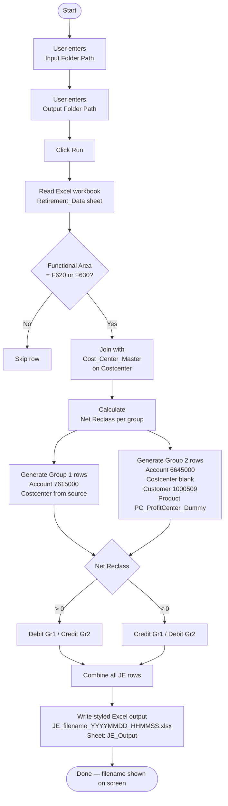

# Reclass JE Generator

Web app that reads an FA Gain/Loss retirement reclassification Excel workbook and produces a styled Journal Entry upload file.

## Project structure

```
mew-reclass/
├── backend/
│   ├── app.py            # Flask server (serves frontend + API)
│   ├── processor.py      # Core business logic
│   ├── requirements.txt
│   └── tests/
│       └── test_processor.py
├── frontend/
│   ├── index.html
│   ├── css/style.css
│   └── js/app.js
└── input/                # Sample Excel workbooks
```

## Prerequisites

- Python 3.9 or later
- The project virtual environment **or** a system Python install

## Setup

```bash
# From the project root (mew-reclass/)
venv\Scripts\activate          # Windows
# source venv/bin/activate     # macOS / Linux

pip install -r backend/requirements.txt
```

## Run the app

```bash
# From the project root
venv\Scripts\python backend\app.py
```

Then open **http://localhost:5000** in your browser.

## Usage

1. **Input Folder Path** — paste the full path to the folder that contains your Excel workbook.  
   The workbook must have two sheets: `Retirement_Data` and `Cost_Center_Master`.  
   Example: `C:\Users\tanap\mew-reclass\input`

2. **Output Folder Path** — paste the full path where the JE file should be saved.  
   The folder is created automatically if it does not exist.  
   Example: `C:\Users\tanap\mew-reclass\output`

3. Click **Run**. When complete, the output filename and full path are shown on screen.

## Output

- File name: `JE_<source-filename>_<YYYYMMDD_HHMMSS>.xlsx`
- Sheet name: `JE_Output`
- Header row: light-green background (`#90EE90`), black bold font

## Excel workbook requirements

| Sheet | Required columns |
|---|---|
| `Retirement_Data` | Company Code, Posting Date, Cockpit Req No, Item Text, Profit Center, Costcenter, Functional Area, Gain, Loss |
| `Cost_Center_Master` | Costcenter (join key), plus any additional descriptive columns |

Only rows where **Functional Area** is `F620` or `F630` are processed.

## Business workflow



## Run tests

```bash
# From the backend/ directory
cd backend
..\venv\Scripts\pytest tests\ -v
```

## Business logic summary

| Group | Account | Costcenter | Debit | Credit |
|---|---|---|---|---|
| Group 1 | 7615000 | From source row | Net Reclass > 0 | Net Reclass < 0 |
| Group 2 | 6645000 | *(blank)* | Net Reclass < 0 | Net Reclass > 0 |

Group 2 rows also receive `Customer = 1000509` and `Product = PC_<ProfitCenter>_Dummy`.
